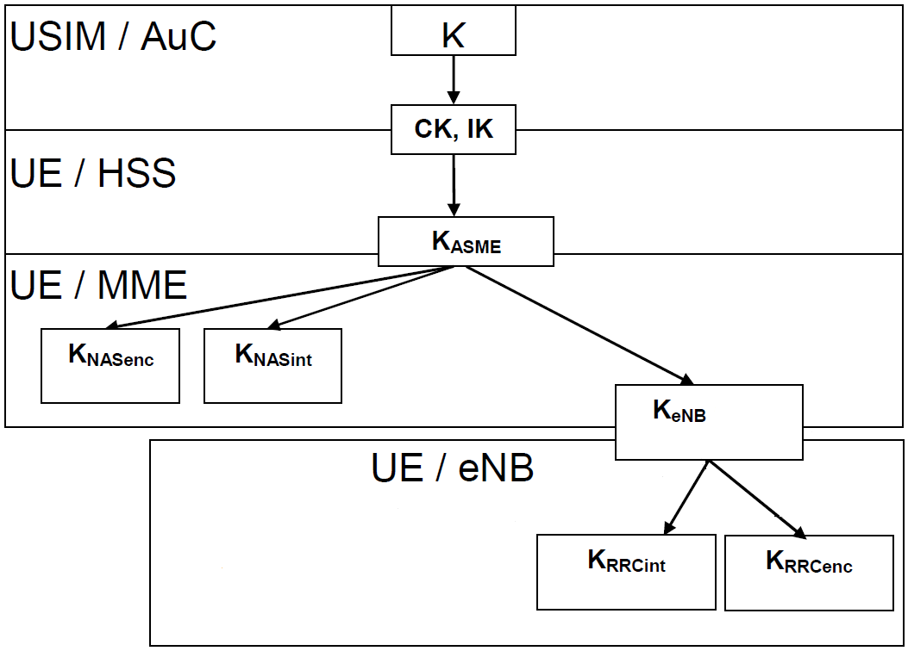

% 4G/LTE Security
% Satyendra Gurjar
% March 2013

# LTE Network Architecture Overview

# Cryptography Overview
> + Symmetric Ciphers
    - Protects **Confidentiality**
      

> + Message Authentication Code (MAC)
    - Protects **Integrity**, no confidentiality.
      

# User Identity in 4G network
> - 
> - Universal Integrated Circuit Card (UICC)
> - USIM (Universal Subscriber identity module)
> - User's permanent identity
    + International Mobile Subscriber Identity (IMSI)
> - User's shared secret
    + Permanent key, K

# Authentication and key agreement (AKA)

# Authentication and key agreement (AKA)
- UE connectivity is established in following steps:
    1. System acquisition & RRC connection establishment
    2. Intial Attach
    3. Authentication
    4. NAS security establishment
    5. AS security establishment
    6. PDN connectivity and IP address allocation

# Authentication and NAS security establishment

# AS security establishment

# PDN connectivity and IP address allocation
- When the RRC connection was setup, the UE had piggybacked two NAS messages.
  The second of those messages, the PDN Connectivity Request, caused the MME
  to establish a default bearer for user traffic between the UE and a P-GW
  after authentication was completed.
- As part of the bearer establishment in the EPC, the P-GW allocated
  an IP address for the UE. The IP address is delivered to the UE in the NAS
  Activate Default EPS Bearer Context Request message.

# EPS key hierarchy

# Algorithms for ciphering and integrity protection
- Ciphering Algorithms
  

# EPS key hierarchy
- Integrity Algorithms
  

# Questions/Comments
