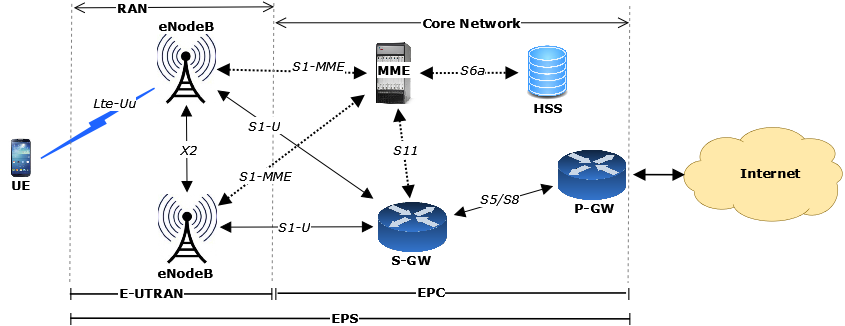
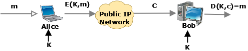
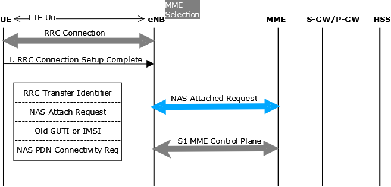
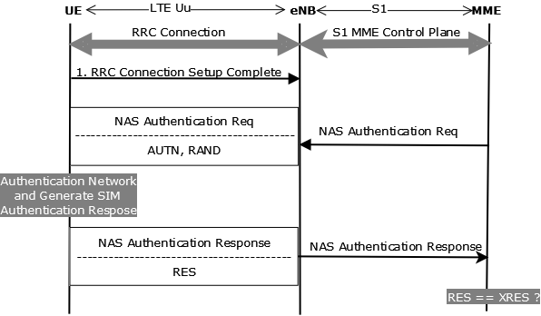
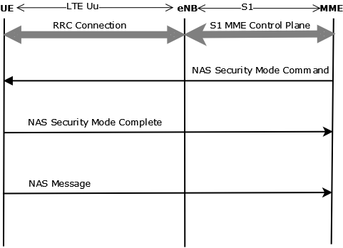
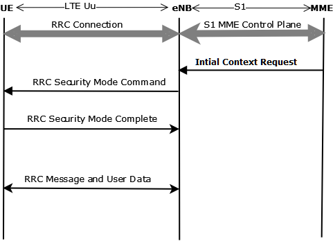
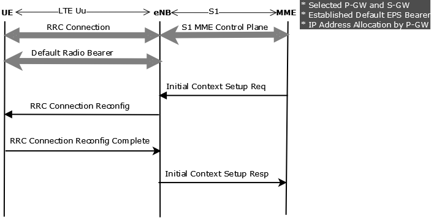
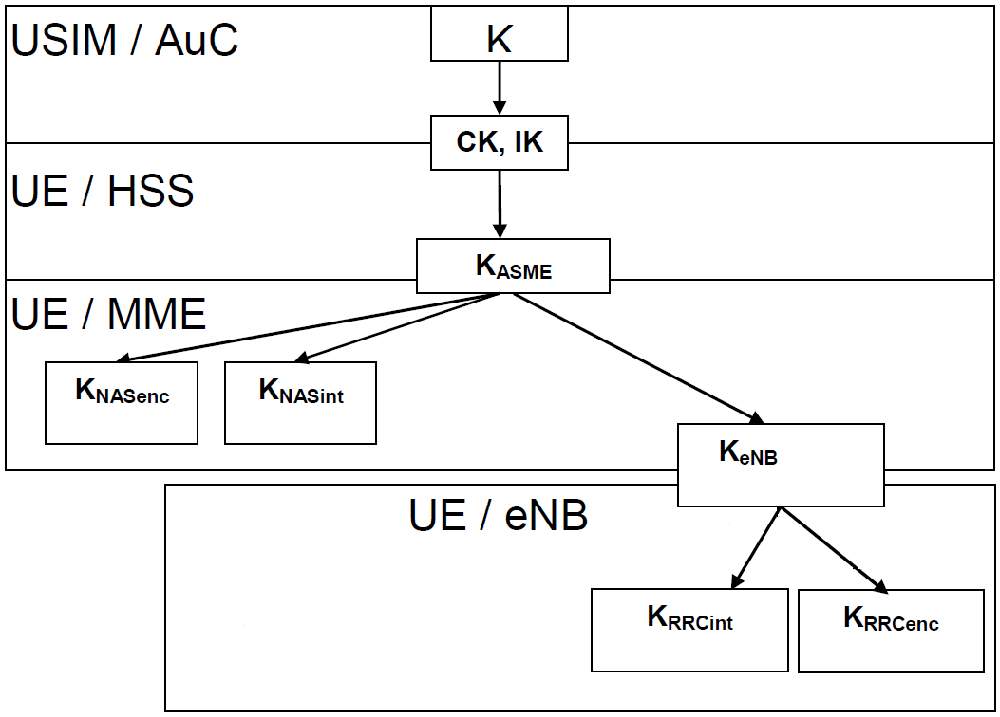
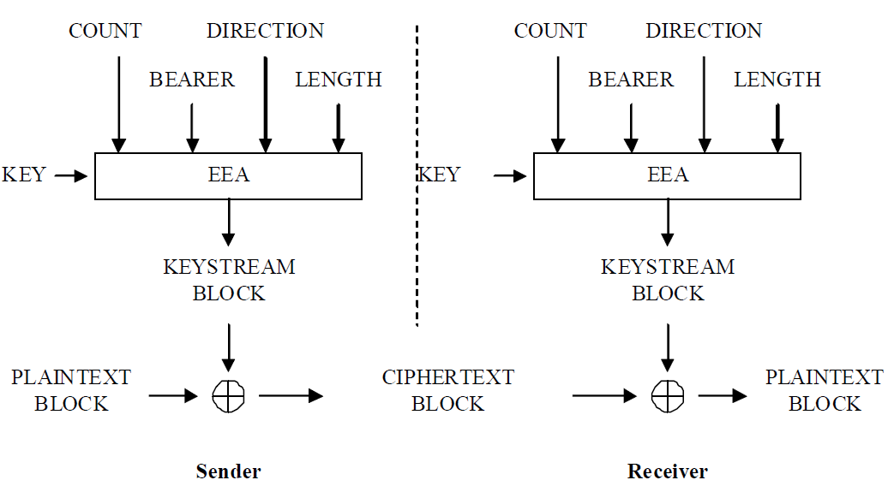
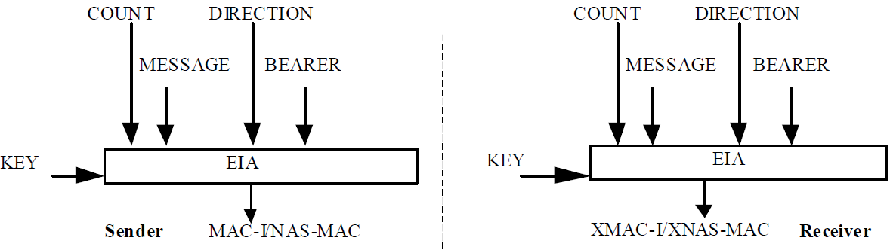

% 4G/LTE Security
% Satyendra Gurjar
% March, 2013

LTE Network Architecture Overview
---------------------------------

LTE network architecture consists of two networks, which connect a mobile (UE)
to a Packet Data Network (PDN). LTE network are

 1. Radio Access Network (RAN) also called Evolved UMTS Terrestrial Radio Access Network (E-UTRAN)
 2. Packet Core Network (CN) also called Evolved Packet Core (EPC)

E-UTRAN and EPC together called EPS (Evolved Packet System)

The air interface is located between a UE and the eNB. This interface uses

 * Orthogonal Frequency Division Multiple Access (OFDMA) on the downlink and
 * Single Carrier Frequency Division Multiple Access (SC-FDMA), an OFDMA variant, on the uplink.

OFDMA is very spectrally efficient and allows for the use of multiple antenna
techniques like Multiple Input Multiple Output (MIMO).

### Evolved Node B (eNB)

The primary function of the eNB includes

  * Scheduling of uplink and downlink air interface resources for UEs, control of
    bearer resources, and admission control.
  * Transfer of paging messages which are used to locate mobiles when they are idle.
  * Communicating common control channel information over the air
  * Header compression, encryption and decryption of the user data sent over the air
  * Establishing handover reporting and triggering criteria.
  * eNBs collaborate with each other over the X2 interface for functions like
    handover and interference management.

The eNBs communicate with the Mobility Management Entity (MME) via the
S1-MME interface and to the S-GW with the S1-U interface. The eNBs and the
EPC have a many-to-many relationship to support load sharing and redundancy
among MMEs and S-GWs. Selects an MME from a group of MMEs so the load can
be shared by multiple MMEs to avoid congestion.

### Mobility Management Entity (MME)
The MME manages

  * Subscriber authentication
  * Maintains a context for authenticated UEs
  * Establishes data bearer paths in the network for user traffic.
    Responsible for selecting the PDN Gateway (P-GW) and the Serving Gateway
    (S-GW) which will make up the ends of the data path through the EPC.
  * Keeps track of the location of idle mobiles which have not detached from the network.
    For idle UEs that need to be reconnected to the access network to receive
    downstream data, the MME will initiate paging to locate the UE and re-
    establish the bearer paths to and through the E-UTRAN.

All communication to MME, from eNB and S-GW, happens in control plane
over S1-MME interface.

### Home Subscriber Server (HSS)
HSS is subscriber database, responsible for storing

  * QoS subscriber profile
  * Roaming restrictions list
  * Address of current serving mobility management entity (MME)
  * Current Tracking Area (TA) of UE
  * Authentication vectors and security keys per UE

HSS talks to MME (and MME only) in control plane over S6a interface.

### Serving Gateway (S-GW)

  * S-GW is the UE's bearer path anchor in the EPC; as the UE moves from one
   eNodeB to another during mobility operations, the S-GW remains the same
   and the bearer path towards the E-UTRAN is switched to talk to the new
   eNB serving the UE.

  * If the UE moves to the domain of another S-GW, the MME is responsible for
   transferring all of the UE's bearer paths to the new S-GW.

  * S-GW establishes bearer paths for the UE to one or more PDN Gateways
   (P-GWs). Should downstream data be received for an idle UE, the S-GW will
   buffer the downstream packets and request the MME to locate and re-
   establish the bearer paths to and through the E-UTRAN.

### PDN Gateway (P-GW)

P-GW functions primarily as a router for user traffic. It functions includes--

  * IP address allocation for the UE
  * packet filtering of downstream user traffic to ensure it is placed on the
    appropriate bearer path
  * Enforcement of downstream Quality of Service (QoS), including the data rate.

Cryptography Overview
---------------------

### Symmetric Encryption

  * Symmetric encryption is consist of following three parts-

      1. Encryption Algorithm (E)
      2. Decryption Algorithm (D)
      3. Shared Key (K)

  * For a given plain text message, m, symmetric encryption is defined as

  

      E( K,m ) -> c
      D( K,c ) -> m

      Where,
        E, D : Cipher
        m, c : Plain text, Cipher text

  * Both sides needs to know shared secret key.

  * Examples:
    + DES
    + AES
    + SNOW 3G

### Message Authenticiation Code (MAC)

  * MAC provides integrity, no confidentiality.

  * Defined as pair sign (S) and verification (V) algorithms, such as for a given
    message, m, S(m) produces a tag (t) which can be verified by V(m,t).
    $$ S(m) \to t \textrm{ message integrity is maintained if } V(m,t) \to \textrm{ true } $$
    Here, Length of message may be very large (in MB/GB) than tag (128/256 bits).

  * Tag is also called hash, and MAC is hash function. A good hash function
    has negligible probability (less than 1/2^60^ ) of collision. Hash Collision
    is defined as, Let `H` be a hash function and `M` set of all messages
    $$M=\{m_i : i \in I \}$$ then `H` collides if
    $$ \exists \textrm{ } i, j \in I \textrm{ such that } H(m_i) = H(m_j) \textrm{ where } i \neq j $$

  * Examples:
    + SHA-1 (160 bits tag),
    + SHA-256 (256 bits tag),
    + MD5(128 bits tag)

  * __Requirement__ Both sides have message that needs to be verified and key is
   not required.

LTE Security Requirements
-------------------------

### User Identity Confidentiality
  * __User Identity Confidentiality__: Permanent user identity (IMSI) of a
    user to whom a services is delivered cannot be eavesdropped on the radio
    access link.

    User's MSIN, the IMEI, and the IMEISV should be confidentiality protected.
    The UE shall provide its equipment identifier IMEI or IMEISV to the
    network, if the network asks for it in an *integrity protected* request.
    The IMEI and IMEISV shall be securely stored. The UE shall not send IMEI or
    IMEISV to the network on a network request before the NAS security has been
    activated. User is normally identified by a temporary identity (GUTI) by
    which he is known by the visited serving network.

  * __User Location Confidentiality__: Presence or the arrival of a user in a
    certain area cannot be determined by eavesdropping on the radio access
    link.

    User should not be identified for a long period by means of the same temporary identity.

  * __User Untraceability__: An intruder cannot deduce whether different
    services are delivered to the same user by eavesdropping on the radio
    access link.

    Any signalling or user data that might reveal the user's identity is
    ciphered on the radio access link.

### Data Confidentiality
  * __Cipher Algorithm Agreement__: UE and the CN can securely negotiate the
    algorithm that they shall use subsequently.

  * __Cipher Key Agreement__: UE and the CN agree on a cipher key that they
    may use subsequently.

  * __Confidentiality Of User Data__: User data cannot be overheard on the
    radio access interface.

  * __Confidentiality Of Signalling Data__: Signalling data cannot be overheard
    on the radio access interface.

### Data integrity
  * __Integrity Algorithm Agreement__: UE and the CN can securely negotiate the integrity algorithm that they shall use subsequently.

  * __Integrity Key Agreement__: UE and the CN agree on an integrity key that they may use subsequently.

  * __Data integrity and origin authentication of signalling data__:
     Receiving entity (UE or CN) is able to verify that signalling data has not
     been modified in an unauthorised way since it was sent by the sending
     entity (CN or UE) and that the data origin of the signalling data received
     is indeed the one claimed.

User Identity
-------------
International Mobile Subscriber Identity (IMSI) is user's permanent identity and
its stored in USIM (Universal Subscriber identity module) application running on
Universal Integrated Circuit Card (UICC), a physical smart card in UE. USIM also
store a permanet key, K, that is never sent outside this module. Home Subscriber
Server (HSS) stores user's IMSI and permanent key and Mobile Management Entity
(MME) identifies subscriber using IMSI. Permanent key, K, is shared secret
between MME and UE, it never sent over network. Permanent key, K, is used to
derive keys for confidentiality (encryption) and integrity protection of user
and control data.

Before scurity context (NAS and AS) is established, EPC (MME) needs to
authenticate UE. Authentication data is sent over clear text, to avoid sending
user's IMSI over network MME creates temporary ids (GUTI) of the secure and
stores GUTI to IMSI mapping in HSS. The GUTI is allocated for the purposes of
user identity confidentiality.

Globally Unique Temporary UE Identity (GUTI) has two main components:

1. GUMMEI, which globally uniquely identifies the MME that allocated the GUTI
2. M-TMSI, which uniquely identifies the UE within the MME that allocated the GUTI.

The GUMMEI (Globally Unique MME Identifier) is constructed from the Mobile
country code (MCC), the Mobile network code (MNC) and the MME Identifier
(MMEI).

For certain procedures, such as paging and service requests, a shortened
version of the GUTI is used, namely the S-TMSI. The S-TMSI consists of the
M-TMSI and a part of the MMEI. The S-TMSI is to enable more efficient radio
signalling procedures.

User Authentication
-------------------

UE connectivity is established in following steps:

  * System acquisition & RRC connection establishment
  * Intial Attach
  * Authentication
  * NAS security establishment
  * AS security establishment
  * PDN connectivity and IP address allocation

Authentication, NAS/RRC security establishment creates security context for
User's connection. We will discuss these 3 steps in detail as it is main
focus of this paper.

### System acquisition & RRC connection establishment
* When a UE is powered on, it will scan its pre-programmed frequency list
  to find the strongest frequency. Then it will go through the system
  acquisition procedure steps. Which includes

  + Downlink transmission synchronizing, once downlink synchronization is
    complete, the UE will be able to read downlink data from the cell.

  + Cell Selection, for cell selection the UE requires the PLMN ID of the
    network, cell barring status and minimum signal strength threshold from SIB
    type 1.

  + Once cell selection is successful, the UE will read the information in
    SIB Type 2 to get the parameters it requires for beginning uplink
    synchronization.

  + After completing uplink synchronization will the UE be allowed to send
    anything else in the uplink, including the signaling required to create an
    RRC connection.

  + The first message from the UE is the RRC Connection Request. The UE
    will include in this message its UE identity (GUTI or IMSI).

### Intial Attach

* The UE initiates the attach procedure with the completion of setting up the
  RRC connection. The NAS Attach Request is piggybacked to the RRC message.
  Also piggybacked on the RRC message is the NAS PDN Connectivity request
  which will also be passed to the MME for processing after the Attach.

* The eNB, upon receiving the Attach Request will have to select an MME. MME
  selection can be based upon several network operator definable criteria
  including: MME loading, LTE network topology, and which MME last served the
  UE.

* In the Attach Request, the UE will identify itself by sending its IMSI or
  old GUTI.

### Authentication

* As part of processing the initial Attach, the MME will have to perform
  authentication of the subscriber. To initiate authentication, the MME will
  request authentication information from the HSS. The HSS will send an
  authentication token (AUTN), an expected response (XRES) and the RAND it
  used to generate the XRES to the MME. Now the MME has the necessary
  information for completing authentication with the SIM card in the UE.

* The MME sends an Authentication Request to the UE, including the RAND and
  the AUTN which it received from the HSS. The SIM card in the UE will
  process the request, using the RAND it received and its pre-shared secret
  key to generate authentication parameters. The SIM can use this to
  authenticate the requesting network prior to sending any response. If the
  network is authenticated, the UE will send an Authentication Response back
  to the MME, including the Response (RES). If the RES the UE sends matches
  the XRES the MME got from the HSS, then the subscriber is authenticated and
  we can proceed to the next step which is establishing security.

### NAS security establishment

* Now that the subscriber has been authenticated and is allowed to use the
  LTE network, the MME will initiate establishment of security between the UE
  and the MME, and between the UE and the eNB. The first step is to establish
  security for NAS signaling. The MME will first select the NAS integrity and
  encryption algorithm to be used. It will then convey this information to
  the UE in a NAS Security Mode Command message. This message is integrity
  protected. The selection of integrity and encryption algorithms is based on
  a prioritized list configured at the MME and the security capabilities of
  the UE.

* The UE makes a note of the selected encryption and integrity algorithms
  and validates the integrity of the received message. It then acknowledges
  the successful acceptance of the message by sending a Security Mode
  Complete message. This message is both integrity protected and encrypted,
  and all future NAS signaling will be both integrity protected and
  encrypted.

* The integrity procedure starts at the MME with the transmission of the
  NAS Security Mode Command and encryption at the MME starts after receiving
  the Security Mode Complete message. Integrity and encryption procedures
  start at the UE with the transmission of the NAS Security Mode Complete
  message.

### AS security establishment

* Once NAS security is established, the MME will let the eNB know to
  establish a context for the UE. This will cause the eNB to initiate
  establishment of Access Stratum (AS) security with the UE. In this case, it
  is the eNB selecting the RRC integrity and encryption algorithm to be used
  in addition to the user plane (UP) encryption algorithms for user traffic.
  The eNB will then convey this information to the UE in an RRC Security Mode
  Command. This message is integrity protected.

* The UE makes a note of the selected encryption and integrity algorithms
  and validates the integrity of the received message. It then generates the
  keys required for these algorithms. It acknowledges the successful
  acceptance of the message by sending an RRC Security Mode Complete message.
  This message is integrity protected. All subsequent RRC signaling will be
  integrity protected and both signaling and user traffic will be encrypted.

### PDN connectivity and IP address allocation

* In addition to the Attach Request, the UE also requested access to data
  services. Every UE in an LTE network will have at least one default
  connection established to a PDN.

* When the RRC connection was setup, the UE had piggybacked two NAS messages.
  The second of those messages, the PDN Connectivity Request, caused the MME
  to establish a default bearer for user traffic between the UE and a P-GW
  after authentication was completed.

* The MME used a default APN, specific to that UE, which it received from the
  HSS subscriber database to determine to which PDN we are connecting and
  selected the appropriate P-GW for that PDN. Then the MME selected an S-GW
  and established the user traffic bearer in the EPC for the UE. The complete
  bearer path was not completed until security was established on the Access
  Stratum. As part of the bearer establishment in the EPC, the P-GW allocated
  an IP address for the UE. The IP address is delivered to the UE in the NAS
  Activate Default EPS Bearer Context Request message.

* To acknowledge the completion of the Attach procedure and the establishment
  of the default EPS bearer, the UE sends 2 NAS messages to the MME: Attach
  Complete and Activate Default EPS Bearer Context Accept.

* The default bearer connects from the UE to the P-GW and gives the UE
  "always-on" connectivity to the PDN.

Authentication and key agreement (AKA)
--------------------------------------

* The MME sends to the USIM via UE the random challenge RAND and an
  authentication token AUTN for network authentication from the selected
  authentication vector.

* At receipt of this message, the USIM shall verify the freshness of the
  authentication vector by checking whether AUTN can be accepted.

* If so, the USIM computes a response RES. USIM shall compute CK and IK which
  are sent to the UE.

* UE shall respond with User authentication response message including RES in
  case of successful AUTN verification.

* In this case the UE shall compute K~ASME~ from CK, IK, and serving network's
  identity (SN id)

* The MME checks that the RES equals XRES. If so the authentication is
  successful.

* The following keys are shared between UE and HSS:
  + K is the permanent key stored on the USIM on a UICC and in the
    Authentication Centre AuC.
  + CK, IK is the pair of keys derived in the AuC and on the USIM during an
    AKA run.
  + As a result of the authentication and key agreement, an intermediate key
    K~ASME~ shall be shared between UE and MME.

### User identification by a permanent identity
* Whenever the user cannot be identified by means of a temporary identity (GUTI).
  + Initiated by the MME that requests the user to send its permanent identity.
  + User's response contains the IMSI in cleartext. This represents a breach in
    the provision of user identity confidentiality.

EPS key hierarchy
-----------------
* The EPC and E-UTRAN shall allow for use of encryption and integrity
  protection algorithms for AS and NAS protection having keys of length 128
  bits and for future use the network interfaces shall be prepared to support
  256 bit keys.

* Key hierarchy includes following keys:

  + **K~eNB~**: is a key derived by UE and MME from K~ASME~ or by UE and target eNB

  + **K~NASint~**: is a key, which shall only be used for the protection of NAS
    traffic with a particular integrity algorithm This key is derived by UE and
    MME from K~ASME~

  + **K~NASenc~**: is a key, which shall only be used for the protection of NAS traffic
    with a particular encryption algorithm. This key is derived by ME and
    MME from K~ASME~

  + **K~RRCint~**: is a key, which shall only be used for the protection of RRC
    traffic with a particular integrity algorithm. K~RRCint~ is derived by UE and
    eNB from K~eNB~

  + **K~RRCenc~**: is a key, which shall only be used for the protection of RRC
    traffic with a particular encryption algorithm. K~RRCenc~ is derived
    by UE and eNB from K~eNB~

Key Derivations
---------------
All keys are 256 bits truncated to 128 bits.

### Key Derivations in EPC and E-UTRAN

  * CK/IK and K~ASME~ are created in HSS using Key Derivation Function (KDF)

        KDF(K,IMSI/GUTI)     -> CK/IK
        KDF(CK,IK,SN_Id,SQN) -> KASME

  * MME gets K~ASME~ from HSS and generates K~NASenc~ and K~NASint~ for
    encryption and integrity protection of NAS signalling messages.

        KDF(KASME,NAS_ENC_ALG) -> KNASenc
        KDF(KASME,NAS_INT_ALG) -> KNASint

    It also creates K~eNB~, which is sends to eNodeB.

        KDF(KASME,NAS_COUNT) -> KeNB

  * eNB gets K~eNB~ from MME and creates 2 more keys, namely K~RRCenc~ and K~RRCint~
    for encryption and integrity protection of AS messages.

        KDF(K~eNB~,RRC_ENC_ALG) -> KRRCenc
        KDF(K~eNB~,RRC_INT_ALG) -> KRRCint

### Key Derivations in UE

  * UE derives CK and IK from permanent key, K and its GUTI it got from MME.

        KDF(K,GUTI) -> CK/IK

    To create K~ASME~ UE needs SN_Id (Serving Network Id) and SQN (Sequence Number)
    which it gets during RRC connection setup.

        KDF(CK,IK,SN_Id,SQN) -> KASME

    UE also derives all other keys for encryption and integrity protection of
    NAS and AS message

        KDF(KASME,NAS_ENC_ALG) -> KNASenc
        KDF(KASME,NAS_INT_ALG) -> KNASint
        KDF(KASME,NAS_COUNT)   -> KeNB
        KDF(KeNB,RRC_ENC_ALG)  -> KRRCenc
        KDF(KeNB,RRC_INT_ALG)  -> KRRCint

> Note: All keys are generated in EPS and UE and never sent over air interface.

Algorithms for ciphering and integrity protection
-------------------------------------------------

### 128-bit ciphering algorithm

#### EEA (EPS Encryption Algorithm)

* Inputs:

  + 128-bit cipher key named KEY
  + 32-bit COUNT
  + 5-bit bearer identity BEARER
  + 1-bit direction of the transmission i.e. DIRECTION (0 for uplink and 1 for downlink)
  + Length of the keystream required, LENGTH

* Output:
  + Based on the input parameters the algorithm generates the output
    keystream block KEYSTREAM which is used to encrypt the input plaintext
    block PLAINTEXT to produce the output ciphertext block CIPHERTEXT.

  ------------------------------------
  Ciphering Algo  Block Size  Based on
  --------------  ----------  --------
  EEA1            128-bit     SNOW 3G
  EEA2            128-bit     AES
  ------------------------------------

### 128-Bit integrity algorithm

#### EIA (EPS Integrity Algorithm)

* Inputs:

  + 128-bit integrity key named KEY
  + 32-bit COUNT
  + 5-bit bearer identity BEARER
  + 1-bit direction of the transmission i.e. DIRECTION (0 for uplink and 1 for downlink)
  + Message itself, MESSAGE
  + Bit length of the MESSAGE, LENGTH.

* Output:
Based on these input parameters the sender computes a 32-bit message
authentication code (MAC-I/NAS-MAC) using the integrity algorithm EIA. The
message authentication code is then appended to the message when sent. For
integrity protection algorithms the receiver computes the expected message
authentication code (XMACI/XNAS-MAC) on the message received in the same
way as the sender computed its message authentication code on the message
sent and verifies the data integrity of the message by comparing it to the
received message authentication code, i.e. MAC-I/NAS-MAC.

  ------------------------------------
  Integrity Algo  Block Size  Based on
  --------------  ----------  --------
  EIA1            128-bit     SNOW 3G
  EIA2            128-bit     AES
  ------------------------------------

References
----------
1. 3GPP Technical Specification 33.401 version 10.3.0 Release 10
2. 3GPP Technical Specification 33.102 version 11.5.0 Release 11
3. Forsberg, Dan, Wolf-Dietrich Moeller, and Valtteri Niemi. LTE security. Wiley-Interscience, 2011.
